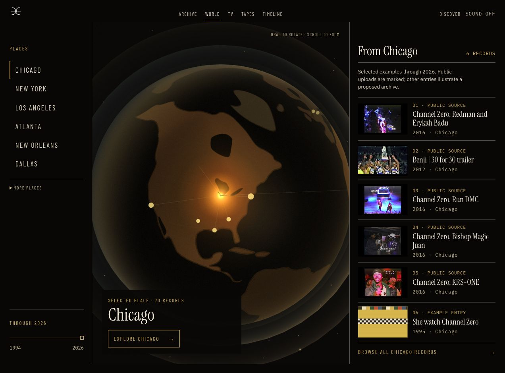
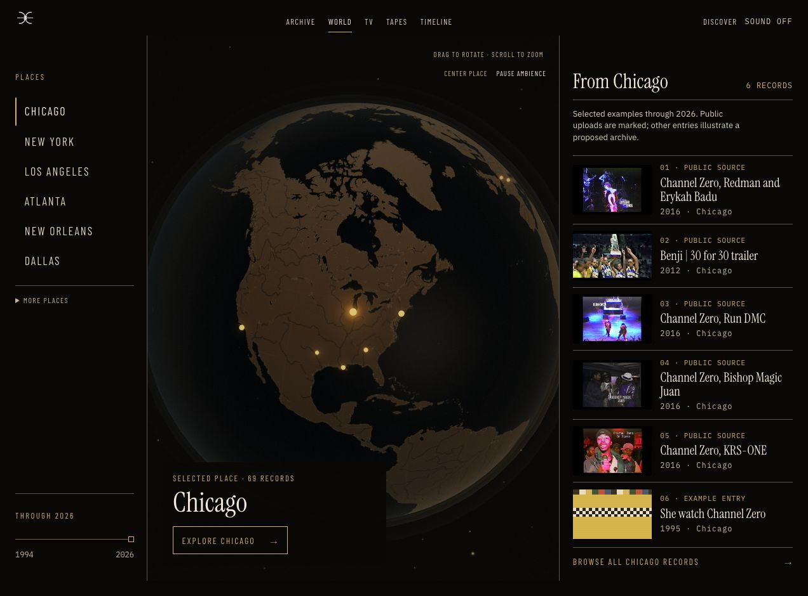

# World and history screenshot update

Captured from the local production build on October 1, 2026. Desktop viewport: 1272 × 939. Phone override: 390 × 844. Each capture was visually inspected; public-video images remain publisher thumbnails, not imported archive footage.

For an email, attach the globe, portfolio, and TV images first. Add the timeline if you want a fourth perspective. Avoid attaching the full Index capture: it is useful for review but too tall for an email.

| Capture | What it demonstrates |
| --- | --- |
| [01-world.jpg](01-world.jpg) | Detailed 3D globe, places, time, and six connected Chicago records |
| [02-portfolio.jpg](02-portfolio.jpg) | Six credited films, videos, and project references; a direct crop of the Index's portfolio section |
| [03-timeline.jpg](03-timeline.jpg) | A focused year, six entry points, optional date refinement, and a collapsed full index |
| [04-tv-projects.jpg](04-tv-projects.jpg) | Five-title public film block, named publisher, previous/next, and program guide |
| [05-sources.jpg](05-sources.jpg) | Eight illustrative source choices and a selected source's connected example records |
| [02-index.jpg](02-index.jpg) | Full Index review: search, six starting records, portfolio, and collapsible year groups |
| [06-timeline-phone.jpg](06-timeline-phone.jpg) | Compact year/thread controls on a phone |
| [07-world-phone.jpg](07-world-phone.jpg) | The 3D globe remains available on a phone |

The Ernie Barnes card is project information only. Source tapes and unapproved frames remain explicitly labeled concept examples. The portfolio shelf distinguishes directing from executive-producing credits.

## Globe comparison

Same Chicago starting view before and after this pass. The geography now has recognizable coastlines, inland water, and rivers; the large location bloom and invented route arcs were removed. Ambient effects remain restrained and can be paused.

Before:

After:

See [the refinement handoff](../../../WORLD_HISTORY_REFINEMENT_2026-10-01.md) for verification boundaries and next steps. These files do not imply that this branch has been promoted to production.
